# caf ☕

A reactive coffee scene for your terminal that keeps your Mac awake.

`caf-art` wraps `caffeinate -d` in a procedurally rendered, physically simulated
cup of coffee. Python 3.11+, with no third-party Python packages. The optional
Swift/Metal renderer uses the macOS GPU and requires Xcode Command Line Tools to build.

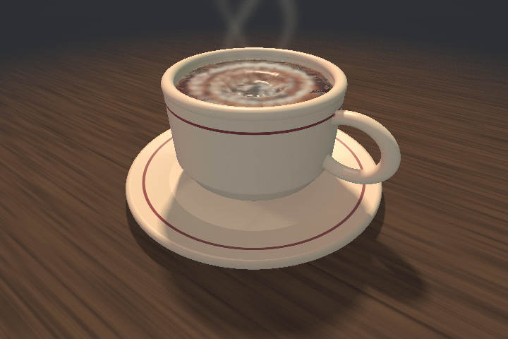

## Diner / 94: graphical mode

On a terminal that **positively answers the Kitty graphics capability query**, `caf`
uses the optional Metal helper automatically. Otherwise it keeps the ANSI renderer;
terminal names alone are not treated as proof of image support.

- Ivory glazed ceramic, oxblood pinstripes, a resting foot and walnut tabletop.
- Soft contact shadows, window/neon reflections, warm steam shafts and a free liquid surface.
- Restrained red/teal diner neon and occasional passing-headlight sweeps; `l` toggles
  them, or start with `--studio` for the simpler lighting.
- World-space steam follows both tilt axes; the steam-written clock still works.
- Fine, stable ordered dithering (`--smooth` swaps it for static ±1 LSB noise), not
  low-resolution upscaling.
- GPU image pipeline: warm key + cool sky ambient, normalized GGX specular with
  Schlick Fresnel, footprint-filtered wood grain/stripes, Beer-Lambert steam with
  self-shadowing, PBR Neutral shoulder tonemap and exact sRGB encoding (optional
  `"exposure"` request key, default 1). A still view accumulates Halton-jittered
  samples into a persistent history (neighbourhood-clipped; rejected when the surface
  under a pixel changes); any camera or cup motion resets it, and those frames
  supersample only material/depth edges instead.
- Ambient light changes the warm/cool lighting balance. The camera rests by default;
  press `o` for auto-orbit.
- Native resolution: the image is rendered at the terminal's real cell pixel size
  (`TIOCGWINSZ`, else a CSI 16t/14t answer, else 6×12), so nothing is rescaled.
- Zero-copy frames: when the terminal also confirms Kitty shared-memory images
  (`t=s`, probed in the same round trip; never over SSH), the GPU renders straight
  into a fresh POSIX shm object per frame which the terminal reads and unlinks —
  no PNG, no base64 of pixels, no pipe copy. Up to 1.6 Mpx (2560×1600 box) this way;
  otherwise a parallel-deflate PNG is sent, capped at 960×720. Unread objects are
  reaped after 16 frames and on exit. `--transport png|shm` (or `CAF_TRANSPORT`)
  forces either path.
- Bounded 30 FPS target. When a frame would miss its budget, the GPU renders frame
  N+1 while frame N is encoded and written (one frame of extra latency; stats lag one
  frame); `CAF_PIPELINE=on|off` overrides. Sensor samples are buffered independently
  of rendering. On the development Mac (M5 Max), warm APIC + rendering + IPC + encode
  to the final Kitty escape over 320 frames of cream, stirring and a knock-over,
  median / p95 ms:

  | frame | PNG | shm | PNG, pipelined | shm, pipelined |
  |---|---|---|---|---|
  | 720×480 | 16.6 / 18.4 | 14.0 / 15.2 | 14.0 / 19.0 | 13.7 / 15.2 |
  | 960×720 | 20.0 / 21.8 | 15.4 / 16.3 | 15.2 / 16.8 | 15.2 / 16.6 |
  | 1440×960 | 27.0 / 29.8 | 17.4 / 18.2 | 20.2 / 21.7 | 17.2 / 18.2 |

  (The previous serial PNG path measured 19.8 / 20.8 at 720×480.) These numbers
  predate the adaptive-substep solver, which cut median GPU time from ~12.4 ms to
  ~7.4 ms at 720×480 (serial PNG total 15.0 / 20.8 ms). Terminal
  decoding and display are excluded; this is not a guaranteed end-to-end frame rate.
- Missing helper, unavailable GPU, unsupported terminal or a failed render falls back
  to the CPU path. `--ansi` explicitly disables images; `--renderer cpu` disables Metal.

### Teach it your laptop's tilt directions

```sh
caf --calibrate
caf
```

The guided calibration samples three **held-still** poses: level, right edge down,
then far edge down. Tilt the whole laptop gently about 10–20 degrees; don't twist the
lid. It saves validated screen axes to `~/.config/caf/imu.json`. Cancelling or a bad
capture preserves the previous calibration. Calibration does not run caffeinate or
change sleep settings.

Start `caf` in a comfortable level pose. After the initial one-second settling period,
that zero stays **locked**: a side tilt no longer fades away as you hold it. `z` re-zeros
without discarding the directional mapping. `--auto-level` opts back into the old slow
re-level behavior. Without a saved mapping, the existing sensor-axis heuristic remains
available. `caf --imu-tilt` shows both axes; actual physical signs should be checked
on your machine after calibration.

### Real 3D liquid and spills

Metal mode now defaults to `--fluid apic`: a persistent **3D APIC particle/grid
solver**, not a tilted heightfield or canned splash. Pressure projection keeps
liquid approximately incompressible; both calibrated tilt axes change gravity.
Coffee can rise over the rim, form streams and detached drops, hit the saucer,
and collect on the table. Returning to level lets it settle; spilled coffee does
**not** respawn inside the cup. The status shows the fraction remaining and spilled.

- `s`: remove a sip; when low, pour a refill instead.
- `f`: pour a refill, leaving existing spills alone.
- `r`: deliberately reset to a full cup and clean table.
- `space` / `x`: stir / give the liquid and cup a small impulse.
- `m`: pour cream into the coffee; stir it into moving ribbons and gradually mix it.
- `k`: strongly knock the cup; `r` stands it back up and clears all liquid/cream.
- `l`: toggle cinematic lighting without resetting the simulation.
- `z`: re-zero laptop gravity, **without** deleting spills.
- `--fluid legacy`: the previous GPU heightfield; CPU/ANSI also retain their
  existing simulation. Real 3D spilling requires the Metal helper.

The free surface now uses a finer **224×128×224 covariance-aware reconstruction**
over anisotropic (Yu–Turk) particle kernels: a particle's neighbour covariance
narrows its kernel across airborne sheets, centres are Laplacian-smoothed, and one
band-limited smoothing pass plus motion-adaptive blending with the previous frame
remove particle-scale crumpling and flicker without lagging real motion. Thin
sheets, bounded surface-tension forces and short-range rim adhesion remain. Density-drift
correction prevents particle bunching from silently shrinking the visible liquid.
The underlying pressure grid remains 56×32×56; this is still a finite-resolution
real-time approximation, not film-grade splashes or a scientific CFD instrument.
A model unit now represents **10 cm**: gravity and control impulses use mug-scale
timing. Substeps adapt to the previous frame's fastest liquid and cup surface
speed (CFL 0.8, between 1/120 and 1/480 second; knocks pre-arm fine steps), and
particles advect with a midpoint step so a swirl does not spiral outward. The
pressure solve is **MGPCG** in a single 1024-thread threadgroup (CG preconditioned
by a 56→28→14 Galerkin multigrid V-cycle, stopping at an RMS divergence residual
of 0.0005/s, typically 2–8 iterations), visiting only liquid cells. The free
surface is **ghost-fluid**: a coarse level set from the particle density places
p = 0 at the interpolated surface rather than at air-cell centres (θ ≥ 0.25 so
pour streams still plunge). The curved, tilting cup is a **cut-cell** boundary:
face open fractions weight the pressure matrix, divergence (with area-weighted wall
velocity) and the pressure traction on the cup; the flat table/saucer stay binary.
Projected velocities are
extended two cells into the air so surface particles never sample raw, unprojected
faces. Floor drag is time-scaled, rather than applied repeatedly during collision
projection. Small ripples and thin films
below the grid resolution are still approximations.

**Fine splashes have actual volume.** Sparse fast splash edges and rim drips can
break into eight smaller ballistic droplets, preserving the parent's volume and
linear momentum. Droplets rejoin the bulk flow on contact; cup and wet-surface
impacts produce short-lived ripples rather than permanent animated noise.
Resolvable sheets (an over-the-rim pour) are not dusted: where the APIC strain
says a sheet is stretching, a particle is reseeded as four on-grid quarters along
the two stretching axes, so the sheet thins but stays continuous.

**Spills leave a wet surface behind.** A conservative thin-film layer spreads
across the fixed saucer and table, with gravity-driven flow, glossy wetness and
edge-enhanced evaporation. Coffee and cream pigment travel with it, then pin into
irregular drying edges—not stamped circular decals. Moving the cup reveals the
wet patches and residue underneath. They persist for the current run until `r` or
restart; they are not saved to disk. Drying pauses when the terminal loses focus.
The 384×384 film covers an 80 cm square with a sealed outer edge and a maximum
3.2 mm depth; deeper pools remain in APIC and do not directly evaporate. This is
a reduced-dimensional coating/normal model, not a fully resolved contact-line or
film-geometry solver, and drying time is intentionally accelerated.

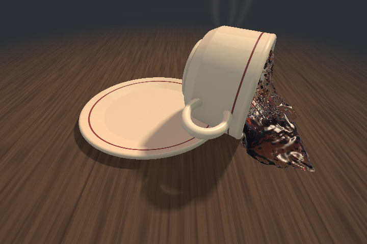
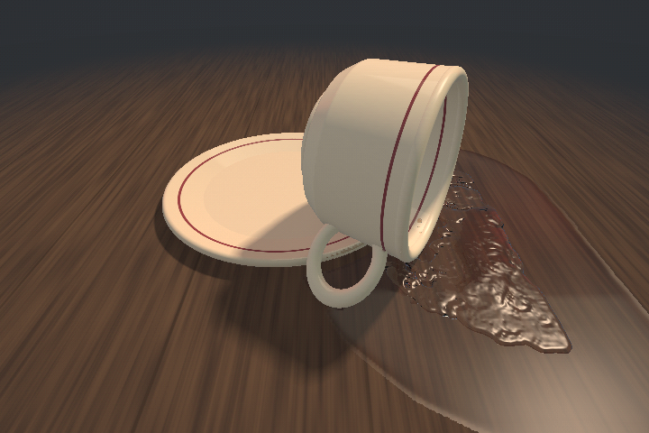

**Coffee transmits light rather than wearing an opaque brown surface.** A bounded
refracted ray samples actual liquid thickness, RGB absorption, and ceramic/table
behind it: deep coffee is dark; thin spills transmit amber light. Fresnel reflection
remains at the surface. There is no procedural cream-colored pattern in APIC mode;
only added cream scatters light. This is a real-time single-path approximation,
not a full multiple-scattering/path-traced renderer.

**Cream is transported, not painted.** A small moving pour adds cream-bearing
particles. Concentration follows the flow with gentle diffusion. Cold cream is
modelled ~2.5% denser than hot coffee, so the pour plunges and spreads low until
stirring lifts it. Stirring is a submerged spoon circling the cup plus a weak bulk
swirl, with vorticity confinement and wall skin friction, so it sheds shear
ribbons and spins down over seconds rather than painting concentric rings. A short
absorption/scattering integration reveals cream below the surface. This is a
single-fluid concentration model with stylized optics, not a separate multiphase
milk solver or a canned latte-art animation.

**The cup is a moving rigid body.** Its foot, shell, rim and handle contact the
saucer/table; the same transformed geometry drives rendering and liquid collision.
Moving-wall velocities, pressure traction and collision impulses couple cup and
coffee. A settled cup holds still under moderate tilt (static friction ≈0.7,
solved before integration so it cannot creep). Depending on knock direction, the handle may catch the saucer instead of
letting the cup fall over. Try `k` rather than shaking the laptop; orbiting changes
the screen-relative knock direction. Use `--cup locked` to retain a fixed cup.
There is no timed housekeeping or automatic refill. A rocking cup can recover
naturally through contact forces; `r` deliberately restores the whole scene.

**Optional impact foley:** `caf --sound` adds ceramic contacts and liquid splats
whose timing/intensity follows measured physics. Playback is rate-limited to three
voices, and quitting stops/reaps them. Audio remains off by default.

**Focus-aware idle is automatic.** In terminals that report focus (xterm mode
1004, including compatible Ghostty configurations), switching away pauses drawing,
liquid/cup simulation, sensor polling and incidental foley. The native helper stays
loaded but receives no frames. Pomodoro deadlines, timer bells, `caffeinate` and
the lid guard remain active. Refocusing resumes from the same liquid state without
fast-forwarding missed physics or replaying buffered laptop motion. `q`/Ctrl+C
still quit while idle, and focus reporting is disabled during cleanup.
Terminals or multiplexers that do not forward focus events remain active; there
is no unreliable guessed-focus fallback. The existing IMU bridge service is not
stopped or reconfigured.


The full cup starts with 15,032 equal-volume particles. Sources/sinks, droplets,
deposited film and particles leaving the finite simulation domain are explicitly
accounted for. Volume is tracked in eighth-particle units; deposited water remains
accounted for as either wet film or evaporation. The bounded source budget is
60,000 original-particle equivalents, with 120,000 internal slots for breakup.
Both are append-only until `r`; exhausted breakup slots simply prevent new splits.
A full empty-cup refill takes several seconds rather than instantly packing
thousands of particles into a tiny nozzle. The saucer stays fixed. There is no
ceramic fracture, replay or lid-angle tracking.
The lid guard and sleep configuration remain unchanged.

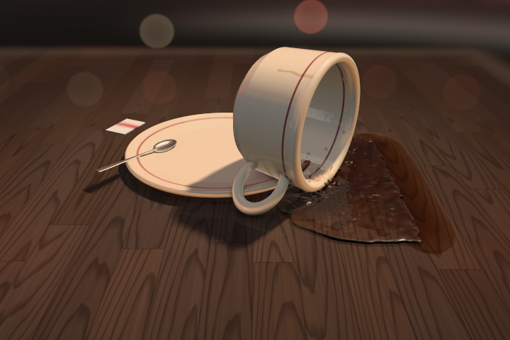

Pomodoro work removes excess liquid, but never heals a spill; break-time refill
adds actual particles. Because you can spill or sip, remaining coffee need not
exactly match the timer. Manually reset when the allocation is exhausted.

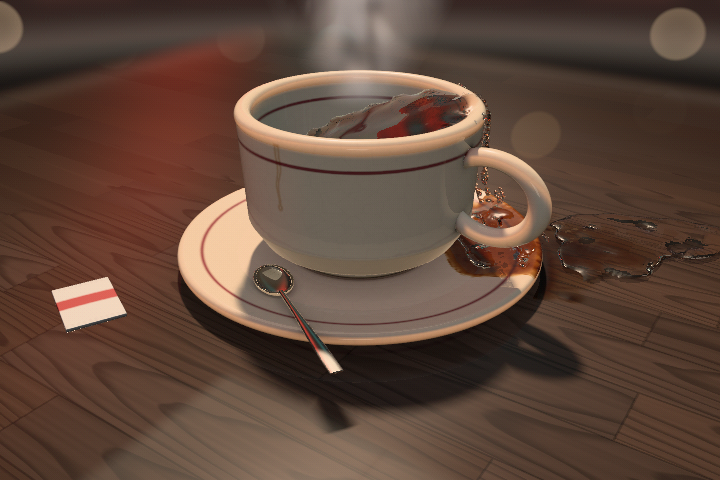

## Existing renderers

`caf --renderer cpu --ansi` keeps the character-based 3D scene. `caf --2d` keeps the
original rigid-body scene. Both can use the new calibration and held-pose lock.

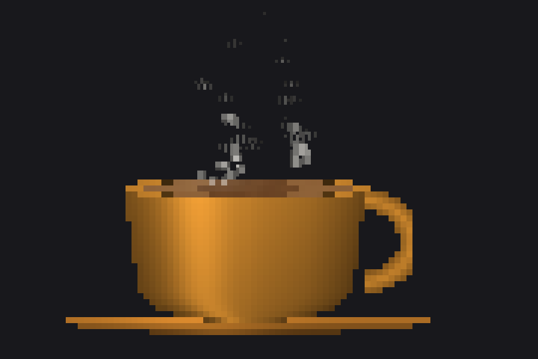

## What's inside

- **Half-block renderer** — the cup, handle, and saucer are drawn into a pixel
  buffer at 2× vertical resolution with truecolor lighting (curvature shading,
  glossy highlight, ambient falloff). 256-color fallback when `COLORTERM`
  isn't truecolor.
- **Braille steam** — steam renders at 2×4 dots per character cell, driven by a
  curl-noise particle simulation. Wisps braid and bend as they rise.
- **Legacy shallow-water surface** (CPU / `--fluid legacy`) — the liquid is a height-field wave simulation on an
  elliptical grid with reflecting walls. Sipping splashes it, stirring drags an
  orbiting spoon through it, refilling pours into it, and waves reflect off the
  cup wall. Lighting comes from the simulated surface slope.
- **CPU load is heat** — a busy machine makes the coffee boil: more steam,
  faster wisps, bubbles breaking the surface. An idle machine lets it calm.
- **Steam writes the time** — every 10 minutes (or on `w`), the steam particles
  converge to spell the clock, hold, and dissolve back into chaos.

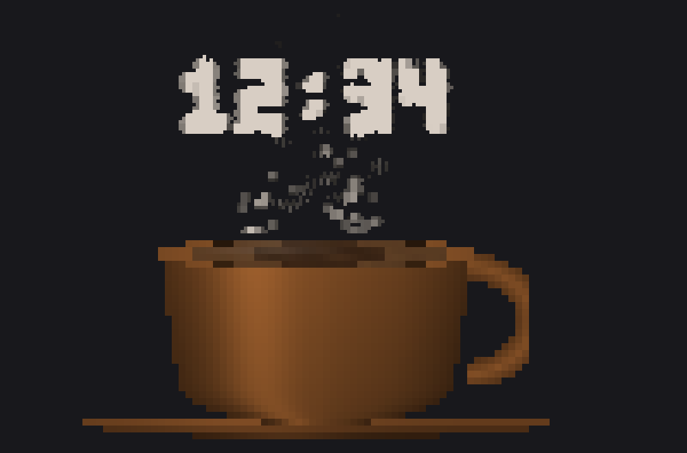

- **Responsive** — layout recomputes from the terminal size every frame;
  resizing rescales the whole scene (and gusts the steam sideways).
- **Window motion is physics** — the terminal's position is polled via the
  xterm `CSI 13 t` report; dragging the window blows the steam around,
  shoving it fast sloshes the coffee by inertia, and vertical jerks push the
  steam toward or away from you in 2.5D (wisps swell and brighten as they
  approach). In 3D mode the camera picks up a parallax nudge too.
- **Real laptop motion is physics** — Apple Silicon MacBooks (M2+) hide a
  real MEMS IMU in the Sensor Processing Unit. A tiny ctypes bridge streams
  it (no sudo, no dependencies). Tilting the laptop doesn't move the cup —
  the terminal is bolted to the machine and so is everything drawn in it —
  it moves **gravity**: the coffee stays level with the real world while the
  cup leans around it, climbing the near wall when you tip the screen toward
  you. Shoves slosh it, spinning steers the 3D camera.

  Orientation is a complementary filter — the gyro turns the up vector every
  sample, the accelerometer pulls it back over half a second — so the coffee
  tracks the screen instead of catching up with it, and a shove is never
  mistaken for a lean. The sensor is not chassis-aligned (a MacBook flat on a
  desk reads a ~20° lean), so the pose `caf` starts in is calibrated as level
  and everything is measured against that; `z` re-zeros it, and that reference stays locked until `z`. With `--auto-level`, a pose you
  settle into becomes the new level over about a minute. `caf-art --imu-tilt`
  is a live readout — if your machine leans the wrong way, set `CAF_IMU_FLIP`
  to any mix of `x` (mirror left/right), `y` (near/far) and `s` (swap).
- **Spill physics** (`--2d`) — in the half-block scene the cup is a rigid
  body. Tilt far enough and the
  coffee runs over the rim, streaks down, stains the saucer, and pools on
  the floor against the terminal walls. Keep going (or knock it with `x`, a
  hard window-shove, or a real-world jolt) and it slides off the saucer,
  tumbles, bounces off the window edges, and dumps everything —
  the steam spells OOPS, and housekeeping restores order a few
  seconds later. Metal APIC also has a movable 3D cup; the CPU/legacy 3D cup remains fixed.
  The older 2D scene retains its automatic housekeeping and screen-edge bounces.

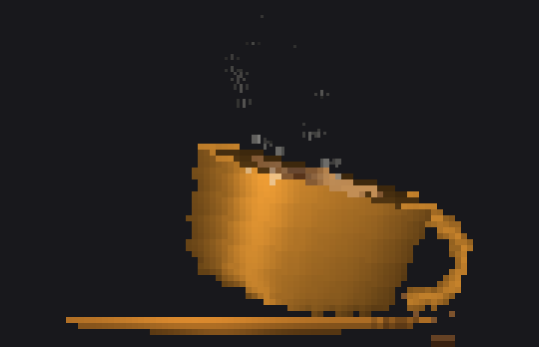

- **Ambient light sensor** — the same SPU exposes the ALS. Dim the room and
  the scene dims to embers (the steam catches what light remains); a bright
  morning brings it back.
- **Sound** (`--sound`) — procedurally synthesized foley (no assets:
  the WAVs are generated on first run): a ceramic clink for stirs, a glug
  for pours, a slurp for sips, a bell for the pomodoro, and a crash when
  the cup meets the floor.
- **Diff rendering** — only changed lines are re-emitted each frame.
- **Kitty graphics mode** (`--hires`) — on Ghostty/kitty, renders the same
  scene as real images at 4 px per cell.

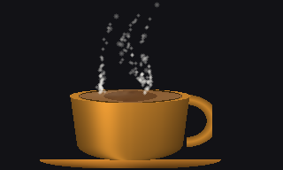

- **Ray-marched 3D mode** (default; `--2d` for the half-block scene) — the
  cup becomes a signed-distance-field
  scene (revolved-profile cup and saucer, torus handle, liquid disc)
  sphere-traced in pure Python: Blinn-Phong shading, fresnel rim light, one
  soft penumbra shadow ray per hit (the cup casts a real contact shadow on
  the saucer), and a single reflection bounce on the liquid that mirrors the
  inner wall. The steam is volumetric — world-space wisps rise off the
  liquid surface, orbit with the camera, catch the key light, and disappear
  behind the cup via a depth buffer. The liquid surface is bump-mapped live
  from the same shallow-water simulation, so stirring and sipping ripple in
  3D, and the surface is a real plane held level with world gravity, so a
  tilted laptop shows as coffee riding up the inside of the wall until it
  brims at the rim. Arrow keys orbit, `o` toggles auto-orbit. ~30 ms/frame
  at 90×30 — no numpy, no GPU, just sphere tracing in a `for` loop.

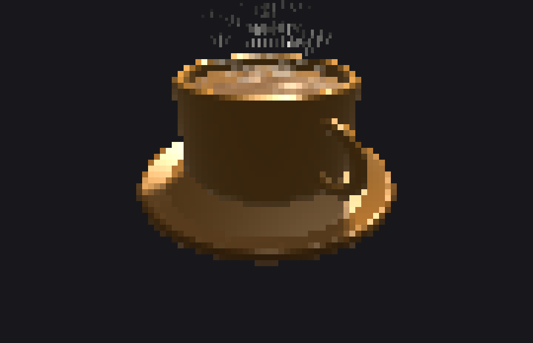

## Usage

```sh
caf-art [preset] [flags]      # ray-marched 3D cup by default
```

**Presets:** `diner` (default) `classic` `matcha` `cyber` `berry` `dark`

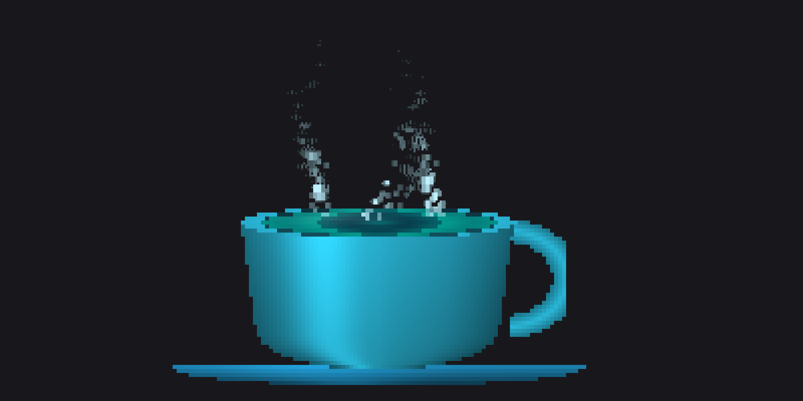

**Keys while running**

| key | action |
|-----|--------|
| `s` | take a sip — the level drops; refills with a pour when low |
| `f` | pour a refill without clearing spills |
| `r` | reset APIC to a full cup and clean table |
| `m` | pour cream into APIC coffee |
| `k` | strongly knock the APIC cup; contact direction determines whether it tips |
| `l` | toggle animated diner lighting |
| `space` | stir — differential flow stretches and mixes the cream |
| `x` | small cup/liquid nudge; legacy 3D remains wave-only |
| `w` | steam writes the current time |
| `t` | cycle themes |
| `z` | call the laptop's current pose level (re-zero the tilt) |
| `q` | quit (Ctrl+C works too) |

**Flags**

| flag | effect |
|------|--------|
| `--fluid apic\|legacy` | genuine GPU liquid (default) or the old heightfield |
| `--renderer auto\|metal\|cpu` | automatically select, request, or disable Metal |
| `--ansi` | force character output |
| `--smooth` | disable GPU dithering |
| `--cup free\|locked` | movable APIC cup (default) or fixed cup |
| `--studio` | disable animated diner lighting |
| `--2d` | original, cheaper half-block rigid-body scene |
| `--pomodoro N` | the coffee **is** the timer: drains over N minutes of work, rings and refills over a 5-minute break, repeats — steam spells `BREAK` and `GO` |
| `--weather` | fetch local weather once (wttr.in): rain streaks, drifting snow, or a warm sun halo |
| `--zen` | screensaver mode: no status line, slow theme crossfades, occasional auto-stirs |
| `--hires` | kitty graphics protocol output (Ghostty, kitty) |
| `--transport auto\|png\|shm` | GPU frame transport: shared memory when the terminal confirms it (default), or force one |
| `--sound` | procedural foley through `afplay` (macOS) |

## Custom themes

`~/.config/caf/themes.toml`:

```toml
[mocha]
name = "Mocha"
icon = "🍫"
cup = [180, 130, 90]
liquid = [60, 35, 20]
crema = [190, 150, 110]
steam = [235, 230, 225]
saucer = [140, 95, 60]
```

## Install

```sh
git clone https://github.com/bookernath/caf.git
cd caf
./install.sh
```

The installer compiles the Metal helper and installs `caf-art`, `caf_graphics.py`,
`caf_motion.py`, `caf-metal`, `caf.metal`, `caf-fluid.metal`, `caf-scene.metal`
and `caf-detail.metal` together in `~/.local/bin`. All four Metal sources are required. Existing files
are copied into a `.caf-backup-*` directory there before replacement. To roll back,
copy the desired backup files back into `~/.local/bin` (the old single-file renderer
ignores the extra helper files).

It does **not** replace `caf-lid-guard` or edit your shell configuration. For a fresh
installation that also needs the optional lid guard, install that separately:

```sh
install -m 755 caf-lid-guard ~/.local/bin/caf-lid-guard
```

For CPU-only use without a Swift compiler, copy `caf-art`, `caf_graphics.py` and
`caf_motion.py` together into `~/.local/bin`, then make `caf-art` executable.

Optionally add a shell alias:

```sh
caf() { ~/.local/bin/caf-art "$@" }
```

The same function is provided in [`caf-shortcut.sh`](caf-shortcut.sh).

`caffeinate` is macOS-only; on other platforms the animation runs without the
keep-awake (a `caffeinate` binary on PATH will be used if present).

## Closing the lid

`caffeinate` — with any flag, including `-s` — only files IOKit power
*assertions*. Lid close is not idle sleep: it's a separate hardware-triggered
sleep path that ignores assertions entirely, so a plain `caffeinate` session
still suspends the instant the lid shuts. Amphetamine's "Closed-Display Mode"
originally used the private assertion property `AppliesOnLidClose`, but macOS
10.13 put that behind the restricted `com.apple.private.iokit.assertonlidclose`
entitlement. The only lever left to third-party code is the kernel
`SleepDisabled` flag, i.e. `pmset disablesleep 1` — which needs root and, left
behind, means the Mac never sleeps again.

`caf-lid-guard` is that lever with a leash:

- one `sudo` prompt at startup unless the optional narrow sudoers rule is installed;
- a **watchdog** clears the flag the moment the owning `caf-art` pid goes
  away — clean exit, Ctrl+C, `kill -9`, closed terminal, crash — and it's
  already root in the interactive-sudo path, so teardown never re-prompts;
- concurrent `caf` sessions refcount, restoring only the pre-caf value;
- a stuck flag from a killed watchdog is reclaimed on the next run;
- if something else (Amphetamine, a manual `pmset`) already set the flag, it's
  left alone;
- while the lid is shut it parks the internal panel once per close
  (`pmset displaysleepnow`), since `SleepDisabled` otherwise leaves it lit and
  cooking under a closed lid.

`caf --no-lid-guard` (or `CAF_NO_LID_GUARD=1`) skips it; `caf-lid-guard status`
shows the current flag, holder count, and lid state.

[`caf-lid-guard.sudoers`](caf-lid-guard.sudoers) preserves the optional setup
template from the original gist. It grants passwordless access only to the listed
`pmset` sleep-toggle commands; the watchdog can then run unprivileged and restore
through that rule. Review the template and validate it with `visudo` before any
manual installation. The renderer installer does **not** install this rule or
change your existing privileges or sleep settings.

## Development and verification

```sh
python3 -B -m unittest discover -s tests -v
# Also exercise actual GPU frames on a Mac with Metal access:
CAF_TEST_METAL=1 python3 -B -m unittest discover -s tests -v
# Legacy GPU material preview: no sensors or power assertions:
python3 -B tools/preview.py --output .build/diner.png
# Reproducible APIC tilt/return snapshots and particle-accounting diagnostics:
python3 -B tools/fluid_probe.py --tilt 22 --frames 270 --render-every 30
python3 -B tools/cinematic_probe.py --action mix --frames 330 --render-every 30
python3 -B tools/cinematic_probe.py --action knock --frames 300 --render-every 30
python3 -B tools/detail_probe.py --seconds 60 --output .build/detail-probe
python3 -B tools/fluid_benchmark.py --output .build/benchmark.json
# Transport comparison (add --pipeline on for the overlapped loop):
python3 -B tools/fluid_benchmark.py --size 720x480,1440x960 --transport png,shm
```

Build the helper without installing:

```sh
mkdir -p .build
xcrun swiftc -O -module-cache-path "$PWD/.build/module-cache" native/caf-metal.swift -o .build/caf-metal
```

`native/caf.metal` contains the renderer; `native/caf-fluid.metal` contains the
APIC solver, concentration transport and particle-surface reconstruction.
`native/caf-detail.metal` owns conservative breakup, wet-film transport,
evaporation, pigment deposition, impact ripples and fine-droplet intersections.
`native/caf-scene.metal` shares collision geometry, rigid-body state and contact
stepping between physics and rendering. `caf_graphics.py` owns the bounded
JSON/RGB helper protocol, shm frame transport and pipelining, color conversion and
the terminal capability/cell-size probe;
`caf_motion.py` owns calibration persistence and the sensor queue. The CPU renderer,
water simulation, keyboard interactions and awake-session lifetime remain in `caf-art`.
GPU tests need device access; sandboxed/headless runs may only have the CPU fallback.
The suite also exercises real keyboard input behind an emulated terminal, with
sensors, audio playback and power assertions disabled. It checks cream mass,
occupied volume/density, cup rest/tipping/handle catches, zero effective gravity,
source/sink accounting, rendering and cleanup. Focus tests send fragmented focus
escapes through a PTY, check zero background frames/polls, advance Pomodoro while
blurred, and verify no catch-up on resume. A falling-coffee test checks physical
gravity timing directly; there is no separate color-test mode.
Detail tests exercise production Metal kernels with controlled inputs for exact
split volume/momentum, exhausted slot capacity, film/pigment conservation and
ripple decay. Real knock/aging tests verify deposition, residue, cream accounting,
zero-time rendering, focus-paused wetness and reset cleanup.

The `CAF_METAL_5` helper and its shaders must be installed together; the shader
layout guard rejects stale helpers rather than permitting mismatched field access.

Technique background: [particle-surface reconstruction](https://faculty.cc.gatech.edu/~turk/my_papers/particle_surfaces_tog.pdf)
and [position-based rigid-body contacts](https://matthias-research.github.io/pages/publications/PBDBodies.pdf).
Optics background: [Beer–Lambert transmittance](https://pbr-book.org/4ed/Volume_Scattering/Transmittance).
Drying background: [capillary flow and ring stains](https://www.nature.com/articles/39827).
Focus protocol: [xterm focus events](https://invisible-island.net/xterm/ctlseqs/ctlseqs.html#h3-FocusIn_FocusOut).
This is a compact custom Metal implementation, not those papers' reference code.

## License

MIT
