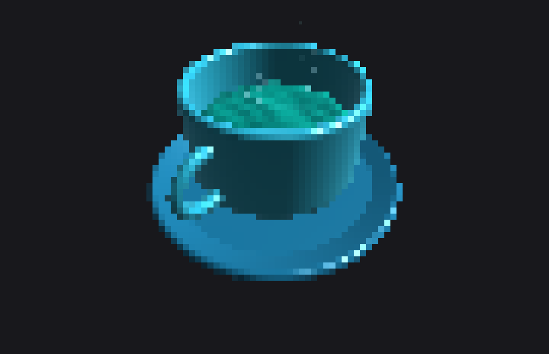

# caf-art ☕

A reactive coffee scene for your terminal that keeps your Mac awake.

`caf-art` wraps `caffeinate -d` in a procedurally rendered, physically simulated
cup of coffee. Zero dependencies — one Python file, Python 3.11+.


## What's inside

- **Half-block renderer** — the cup, handle, and saucer are drawn into a pixel
  buffer at 2× vertical resolution with truecolor lighting (curvature shading,
  glossy highlight, ambient falloff). 256-color fallback when `COLORTERM`
  isn't truecolor.
- **Braille steam** — steam renders at 2×4 dots per character cell, driven by a
  curl-noise particle simulation. Wisps braid and bend as they rise.
- **Shallow-water surface** — the liquid is a height-field wave simulation on an
  elliptical grid with reflecting walls. Sipping splashes it, stirring drags an
  orbiting spoon through it, refilling pours into it, and waves reflect off the
  cup wall. Lighting comes from the simulated surface slope.
- **CPU load is heat** — a busy machine makes the coffee boil: more steam,
  faster wisps, bubbles breaking the surface. An idle machine lets it calm.
- **Steam writes the time** — every 10 minutes (or on `w`), the steam particles
  converge to spell the clock, hold, and dissolve back into chaos.


- **Responsive** — layout recomputes from the terminal size every frame;
  resizing rescales the whole scene (and gusts the steam sideways).
- **Window motion is physics** — the terminal's position is polled via the
  xterm `CSI 13 t` report; dragging the window blows the steam around,
  shoving it fast sloshes the coffee by inertia, and vertical jerks push the
  steam toward or away from you in 2.5D (wisps swell and brighten as they
  approach). In 3D mode the camera picks up a parallax nudge too.
  (Macs no longer ship an accelerometer, so window motion is the honest
  stand-in for waving your laptop around.)
- **Diff rendering** — only changed lines are re-emitted each frame.
- **Kitty graphics mode** (`--hires`) — on Ghostty/kitty, renders the same
  scene as real images at 4 px per cell.


- **Ray-marched 3D mode** (`--3d`) — the cup becomes a signed-distance-field
  scene (revolved-profile cup and saucer, torus handle, liquid disc)
  sphere-traced in pure Python with Blinn-Phong shading, fresnel rim light,
  and a slow orbit camera. The liquid surface is bump-mapped live from the
  same shallow-water simulation, so stirring and sipping ripple in 3D.
  Arrow keys orbit, `o` toggles auto-orbit. ~25 ms/frame at 90×30 —
  no numpy, no GPU, just sphere tracing in a `for` loop.



## Usage

```sh
caf-art [preset] [flags]
```

**Presets:** `classic` `matcha` `cyber` `berry` `dark`


**Keys while running**

| key | action |
|-----|--------|
| `s` | take a sip — the level drops; refills with a pour when low |
| `space` | stir — an orbiting spoon churns the surface |
| `w` | steam writes the current time |
| `t` | cycle themes |
| `q` | quit (Ctrl+C works too) |

**Flags**

| flag | effect |
|------|--------|
| `--pomodoro N` | the coffee **is** the timer: drains over N minutes of work, rings and refills over a 5-minute break, repeats — steam spells `BREAK` and `GO` |
| `--weather` | fetch local weather once (wttr.in): rain streaks, drifting snow, or a warm sun halo |
| `--zen` | screensaver mode: no status line, slow theme crossfades, occasional auto-stirs |
| `--hires` | kitty graphics protocol output (Ghostty, kitty) |

## Custom themes

`~/.config/caf/themes.toml`:

```toml
[mocha]
name = "Mocha"
icon = "🍫"
cup = [180, 130, 90]
liquid = [60, 35, 20]
crema = [190, 150, 110]
steam = [235, 230, 225]
saucer = [140, 95, 60]
```

## Install

```sh
cp caf-art ~/.local/bin/ && chmod +x ~/.local/bin/caf-art
```

Optionally add a shell alias:

```sh
caf() { ~/.local/bin/caf-art "$@" }
```

`caffeinate` is macOS-only; on other platforms the animation runs without the
keep-awake (a `caffeinate` binary on PATH will be used if present).

## License

MIT
